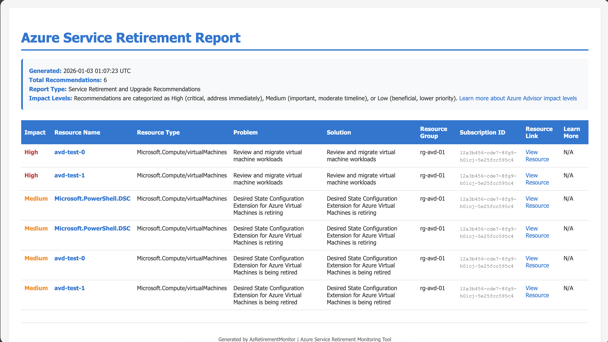

# AzRetirementMonitor

A PowerShell module for monitoring Azure service retirements and deprecation notices using Azure Advisor recommendations.

## What Problem Does This Solve?

Azure services evolve constantly, with features, APIs, and entire services being retired or deprecated over time. Missing these retirement notifications can lead to:

- **Service disruptions** when deprecated features stop working
- **Security vulnerabilities** from running unsupported services
- **Compliance issues** when regulations require supported infrastructure
- **Unexpected costs** from forced migrations under time pressure

**AzRetirementMonitor** helps you proactively identify Azure resources affected by upcoming retirements by querying Azure Advisor for service upgrade and retirement recommendations across all your subscriptions. This gives you time to plan migrations and upgrades before services are discontinued.

## 🚀 Version 2.0.0 - Breaking Changes

**Version 2.0.0 introduces a major change in how the module works:**

- **Default behavior**: Now uses Az.Advisor PowerShell module (full parity with Azure Advisor)
- **API mode**: Available via `-UseAPI` switch on Get-AzRetirementRecommendation
- **Connect-AzRetirementMonitor**: Now only needed for API mode and requires `-UsingAPI` switch

### Migration Guide from v1.x

**Old workflow (v1.x):**
```powershell
Connect-AzRetirementMonitor
Get-AzRetirementRecommendation
```

**New workflow (v2.0):**
```powershell
# Default method (recommended - uses Az.Advisor module)
Connect-AzAccount
Get-AzRetirementRecommendation

# API method (if you prefer the REST API)
Connect-AzRetirementMonitor -UsingAPI
Get-AzRetirementRecommendation -UseAPI
```

## How Do I Install It?

### From PowerShell Gallery (Recommended)

```powershell
Install-Module -Name AzRetirementMonitor -Scope CurrentUser
```

### Manual Installation

1. Clone this repository:

   ```bash
   git clone https://github.com/cocallaw/AzRetirementMonitor.git
   ```

2. Import the module:

   ```powershell
   Import-Module ./AzRetirementMonitor/AzRetirementMonitor.psd1
   ```

### Prerequisites

**For Default Method (Recommended):**
- PowerShell 7.0 or later
- Az.Advisor module: `Install-Module -Name Az.Advisor`
- Az.Accounts module: `Install-Module -Name Az.Accounts`

**For API Method (Alternative):**
- PowerShell 7.0 or later
- One of the following:
  - Azure CLI (`az`)
  - Az.Accounts PowerShell module

## How Do I Authenticate?

### Default Method: Az.Advisor PowerShell Module (Recommended)

This method provides **full parity** with Azure Advisor data.

1. Install the required modules:

   ```powershell
   Install-Module -Name Az.Advisor, Az.Accounts -Scope CurrentUser
   ```

2. Connect to Azure:

   ```powershell
   Connect-AzAccount
   ```

3. Get retirement recommendations:

   ```powershell
   Get-AzRetirementRecommendation
   ```

**That's it!** No need to run `Connect-AzRetirementMonitor` for this method.

### Alternative: REST API Method

If you prefer to use the REST API instead of the Az.Advisor module:

#### Option 1: Azure CLI

1. Install the [Azure CLI](https://learn.microsoft.com/cli/azure/install-azure-cli)
2. Log in to Azure:

   ```bash
   az login
   ```

3. Connect the module for API access:

   ```powershell
   Connect-AzRetirementMonitor -UsingAPI
   ```

4. Get retirement recommendations:

   ```powershell
   Get-AzRetirementRecommendation -UseAPI
   ```

#### Option 2: Az PowerShell Module

1. Install Az.Accounts:

   ```powershell
   Install-Module -Name Az.Accounts -Scope CurrentUser
   ```

2. Connect to Azure:

   ```powershell
   Connect-AzAccount
   ```

3. Connect the module for API access using Az PowerShell:

   ```powershell
   Connect-AzRetirementMonitor -UsingAPI -UseAzPowerShell
   ```

4. Get retirement recommendations:

   ```powershell
   Get-AzRetirementRecommendation -UseAPI
   ```

## What Commands Are Available?

### Get-AzRetirementRecommendation

**Main command** - Retrieves Azure Advisor recommendations related to service retirements and deprecations.

**Default behavior (v2.0+)**: Uses Az.Advisor PowerShell module
**Alternative**: Use `-UseAPI` switch to query REST API directly

```powershell
# Get all retirement recommendations (default Az.Advisor method)
Get-AzRetirementRecommendation

# Get recommendations for specific subscriptions
Get-AzRetirementRecommendation -SubscriptionId "sub-id-1", "sub-id-2"

# Use REST API instead (requires Connect-AzRetirementMonitor -UsingAPI first)
Get-AzRetirementRecommendation -UseAPI
```

**Parameters:**

- `SubscriptionId` - One or more subscription IDs (defaults to all subscriptions)
- `UseAPI` - Use REST API instead of Az.Advisor module

### Connect-AzRetirementMonitor

⚠️ **IMPORTANT**: This command is **only needed for API mode** (when using `-UseAPI`).

For the default Az.Advisor method, use `Connect-AzAccount` instead.

Authenticates to Azure and obtains an access token for REST API calls.

**Parameters:**

- `-UsingAPI` (required): Confirms you intend to use API-based access
- `-UseAzCLI` (default): Use Azure CLI authentication
- `-UseAzPowerShell`: Use Az.Accounts PowerShell module authentication

```powershell
# For API access with Azure CLI (default)
Connect-AzRetirementMonitor -UsingAPI

# For API access with Az PowerShell module
Connect-AzRetirementMonitor -UsingAPI -UseAzPowerShell
```

### Disconnect-AzRetirementMonitor

Clears the access token stored by the module. This does not affect your Azure CLI or Az.Accounts session - you remain logged in to Azure.

The token is securely cleared from module memory and cannot be recovered after disconnection.

**Only relevant when using API mode.**

```powershell
Disconnect-AzRetirementMonitor
```

### Get-AzRetirementMetadataItem

Retrieves metadata about retirement recommendation types from Azure Advisor.

**Note**: This function only works with API mode as Az.Advisor module does not expose metadata cmdlets.

```powershell
# Requires Connect-AzRetirementMonitor -UsingAPI first
Get-AzRetirementMetadataItem
```

```

### Export-AzRetirementReport

Exports retirement recommendations to various formats for reporting and analysis.

Works with recommendations from both default (Az.Advisor) and API methods.

```powershell
# Export to CSV
Get-AzRetirementRecommendation | Export-AzRetirementReport -OutputPath "report.csv" -Format CSV

# Export to JSON
Get-AzRetirementRecommendation | Export-AzRetirementReport -OutputPath "report.json" -Format JSON

# Export to HTML
Get-AzRetirementRecommendation | Export-AzRetirementReport -OutputPath "report.html" -Format HTML
```

**Parameters:**

- `Recommendations` - Recommendation objects from Get-AzRetirementRecommendation (accepts pipeline input)
- `OutputPath` - File path for the exported report
- `Format` - Export format: CSV, JSON, or HTML (default: CSV)

## Understanding Impact Levels

Azure Advisor assigns an impact level (High, Medium, or Low) to each recommendation to help you prioritize actions:

- **High Impact**: Recommendations that can have the greatest positive effect on your environment, such as preventing service disruptions, avoiding security vulnerabilities, or addressing critical retirements. These should be addressed with highest priority.

- **Medium Impact**: Meaningful improvements with moderate effect. These recommendations are important but may have more flexible timelines than high-impact items.

- **Low Impact**: Beneficial optimizations with minor improvements. These are lower priority but still worth addressing when resources allow.

Impact levels are determined by Azure Advisor based on factors including potential business impact, risk severity, resource usage patterns, and the scope of affected resources. For retirement recommendations specifically, the impact level reflects the urgency and criticality of migrating away from deprecated services.

For more information, see [Azure Advisor documentation](https://learn.microsoft.com/azure/advisor/advisor-overview).

## Example Output

### Get-AzRetirementRecommendation (Default Method)

```powershell
PS> Connect-AzAccount
PS> Get-AzRetirementRecommendation

SubscriptionId   : 12345678-1234-1234-1234-123456789012
ResourceId       : /subscriptions/12345678-1234-1234-1234-123456789012/resourceGroups/myRG/providers/Microsoft.Compute/virtualMachines/myVM
ResourceName     : myVM
ResourceType     : Microsoft.Compute/virtualMachines
ResourceGroup    : myRG
Category         : HighAvailability
Impact           : High
Problem          : Virtual machine is using a retiring VM size
Solution         : Migrate to a supported VM size before the retirement date
Description      : Basic A-series VM sizes will be retired on August 31, 2024
LastUpdated      : 2024-01-15T10:30:00Z
IsRetirement     : True
RecommendationId : abc123-def456-ghi789
LearnMoreLink    : https://learn.microsoft.com/azure/virtual-machines/sizes-previous-gen
ResourceLink     : https://portal.azure.com/#resource/subscriptions/.../myVM
```

### Export-AzRetirementReport

```powershell
PS> Get-AzRetirementRecommendation | Export-AzRetirementReport -OutputPath "./retirement-report.html" -Format HTML
```

This creates an HTML report with all retirement recommendations, including resource details, impact levels, and actionable solutions.

**Example HTML Report:**



## Usage Workflow

### Recommended Workflow (Default Az.Advisor Method)

```powershell
# 1. Ensure Az.Advisor is installed
Install-Module -Name Az.Advisor, Az.Accounts -Scope CurrentUser

# 2. Authenticate to Azure
Connect-AzAccount

# 3. Get retirement recommendations
$recommendations = Get-AzRetirementRecommendation

# 4. Review the recommendations
$recommendations | Format-Table ResourceName, Impact, Problem, Solution -AutoSize

# 5. Export for team review
$recommendations | Export-AzRetirementReport -OutputPath "retirement-report.html" -Format HTML
```

### Alternative Workflow (API Method)

```powershell
# 1. Authenticate for API access
Connect-AzRetirementMonitor -UsingAPI

# 2. Get retirement recommendations via API
$recommendations = Get-AzRetirementRecommendation -UseAPI

# 3. Review the recommendations
$recommendations | Format-Table ResourceName, Impact, Problem, Solution -AutoSize

# 4. Export for team review
$recommendations | Export-AzRetirementReport -OutputPath "retirement-report.csv" -Format CSV

# 5. Get metadata about retirement types (API only)
Get-AzRetirementMetadataItem

# 6. Disconnect when finished
Disconnect-AzRetirementMonitor
```

## Comparison: Default vs API Method

| Feature | Default (Az.Advisor) | API Method |
|---------|---------------------|------------|
| **Data Parity** | ✅ Full parity with Azure Portal | ⚠️ May have slight differences |
| **Authentication** | `Connect-AzAccount` | `Connect-AzRetirementMonitor -UsingAPI` |
| **Module Required** | Az.Advisor, Az.Accounts | None (uses REST API) |
| **Usage** | `Get-AzRetirementRecommendation` | `Get-AzRetirementRecommendation -UseAPI` |
| **Metadata** | ❌ Not available | ✅ `Get-AzRetirementMetadataItem` |
| **Recommended** | ✅ Yes | Use when Az.Advisor unavailable |

## How Does Authentication and Token Management Work?

### Default Method (Az.Advisor)

Uses standard Azure PowerShell authentication via `Connect-AzAccount`. The Az.Advisor module handles all authentication and token management internally. Your credentials are managed by the Az.Accounts module using industry-standard OAuth flows.

### API Method

The API method uses a **read-only, scoped token** approach to ensure security and isolation:

1. **Token Acquisition**: The module obtains a time-limited access token from your existing Azure authentication:
   - **Azure CLI**: Uses `az account get-access-token` to request a token from your logged-in session
   - **Az.Accounts**: Uses `Get-AzAccessToken` to request a token from your connected context
   - The module does **not** prompt for credentials or re-authenticate you

2. **Token Storage**: The token is stored in a **module-scoped variable** (`$script:AccessToken`):
   - Only accessible within the AzRetirementMonitor module
   - Not accessible to other PowerShell modules or sessions
   - Automatically cleared when the module is unloaded
   - Can be manually cleared with `Disconnect-AzRetirementMonitor`

3. **Token Scope**: The token is requested specifically for `https://management.azure.com`:
   - Only grants access to Azure Resource Manager APIs
   - Used exclusively for **read-only** operations (Azure Advisor recommendations)
   - Cannot be used to modify Azure resources

4. **Module Isolation**: The module's authentication is completely isolated:
   - `Connect-AzRetirementMonitor -UsingAPI` **does not** authenticate you to Azure (you must already be logged in)
   - `Connect-AzRetirementMonitor -UsingAPI` **only** requests an access token from your existing session
   - `Disconnect-AzRetirementMonitor` **only** clears the module's stored token
   - `Disconnect-AzRetirementMonitor` **does not** affect your Azure CLI or Az.Accounts session
   - You remain logged in to Azure CLI (`az login`) or Az.Accounts (`Connect-AzAccount`) after disconnecting

### Token Lifecycle (API Method)

```powershell
# You authenticate to Azure first (outside the module)
az login  # or Connect-AzAccount

# Module requests a token from your session (does not re-authenticate)
Connect-AzRetirementMonitor -UsingAPI

# Module uses the token for API calls
Get-AzRetirementRecommendation -UseAPI

# Module clears its token (you remain logged in to Azure)
Disconnect-AzRetirementMonitor

# You can still use Azure CLI/PowerShell
az account show  # Still works - you're still logged in
```

### What the Module Cannot Do

For security and transparency, the module is designed with strict limitations:

- ❌ Cannot authenticate you to Azure (requires existing `az login` or `Connect-AzAccount`)
- ❌ Cannot modify, create, or delete Azure resources
- ❌ Cannot access tokens or credentials from other modules
- ❌ Cannot persist tokens beyond the PowerShell session
- ❌ Cannot disconnect you from Azure CLI or Az.Accounts
- ✅ Can only read Azure Advisor recommendations for retirement planning

## Contributing Guidelines

We welcome contributions to AzRetirementMonitor! Here's how you can help:

### Reporting Issues

- Use the GitHub issue tracker to report bugs or request features
- Provide clear reproduction steps for bugs
- Include PowerShell version, OS, and authentication method used

### Pull Requests

1. **Fork the repository** and create a feature branch
2. **Follow existing code style** - use the same patterns as existing functions
3. **Add tests** for new functionality in the `Tests/` directory
4. **Update documentation** if you change functionality
5. **Keep changes focused** - one feature or fix per PR
6. **Test your changes** with both authentication methods (Azure CLI and Az.Accounts)

### Code Style

- Use approved PowerShell verbs (Get, Set, New, Remove, etc.)
- Include comment-based help for all public functions
- Use proper parameter validation
- Write verbose messages for troubleshooting
- Handle errors gracefully

### Testing

Run the Pester tests before submitting:

```powershell
# Install Pester if needed
Install-Module -Name Pester -Force -SkipPublisherCheck

# Run tests
Invoke-Pester ./Tests/AzRetirementMonitor.Tests.ps1
```

### Development Setup

1. Clone the repository
2. Make your changes in a feature branch
3. Test locally by importing the module:

   ```powershell
   Import-Module ./AzRetirementMonitor.psd1 -Force
   ```

4. Run tests and ensure they pass
5. Submit a pull request

## License

This project is licensed under the MIT License - see the [LICENSE](LICENSE) file for details.

## Support

- **Issues**: [GitHub Issues](https://github.com/cocallaw/AzRetirementMonitor/issues)
- **Discussions**: [GitHub Discussions](https://github.com/cocallaw/AzRetirementMonitor/discussions)

This module uses the Azure Advisor API to retrieve retirement recommendations. For more information about Azure Advisor, visit the [Azure Advisor documentation](https://learn.microsoft.com/azure/advisor/).
